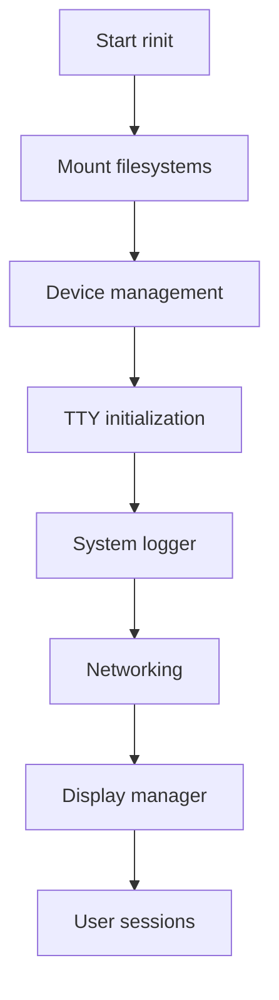

# rastOS Boot Sequence

This document outlines the boot sequence for rastOS, with separate paths for server and desktop deployments.

## Development Paths

### 1. Minimal Server (Priority)
- Focus on headless operation
- Minimal service initialization
- Optimized for container workloads
- No graphical stack

### 2. Desktop (Future)
- Full graphical environment
- Display server integration
- User session management
- Desktop environment services

## Bootloader Phase

### Common Boot Path
1. **Firmware Initialization**
   - CPU and hardware initialization
   - Memory detection and initialization
   - Device enumeration
   - RustVMM hypervisor initialization (if enabled at build)

2. **Bootloader Execution**
   - Load and verify kernel image
   - Set up initial memory mapping
   - Load initial ramdisk (initrd/initramfs)
   - Pass control to kernel

## Kernel Initialization

1. **Early Boot**
   - CPU and architecture-specific initialization
   - Memory management setup
   - Early console initialization

2. **Core Kernel**
   - Process management initialization
   - Interrupt handling setup
   - Timer subsystem initialization
   - Memory management initialization

3. **Device Initialization**
   - Device tree/ACPI parsing
   - Early device drivers
   - Console and early logging

4. **Userspace Transition**
   - Mount root filesystem
   - Execute init process (rinit)
   - Runtime selection based on build configuration:
     - Native mode (direct hardware)
     - RustVMM mode (virtualized)

## Userspace Initialization (rinit)

1. **Early Userspace**
   - Mount essential filesystems (dev, proc, sys)
   - Device node creation
   - Kernel module loading

2. **Service Management**
   - Start essential system services
   - Initialize TTY devices
   - Start getty on console
   - Start system logger

3. **Multi-User Mode**
   - Start networking services
   - **Server Path**:
     - Start container runtime
     - Start orchestration services
   - **Desktop Path (Future)**:
     - Start display manager
     - Start desktop environment
     - Start user sessions

## Service Dependencies



## Recovery and Fallback

1. **Single-User Mode**
   - Minimal services
   - Root shell on console
   - Network disabled by default

2. **Emergency Shell**
   - If init fails
   - Read-only root filesystem
   - Minimal device access

## Shutdown Sequence

1. **Graceful Shutdown**
   - Notify users and processes
   - Stop services in reverse order
   - Unmount filesystems
   - Sync disks
   - Halt system

2. **Emergency Shutdown**
   - Immediate process termination
   - Sync disks
   - Force unmount
   - Power off

## Runtime Selection

### RustVMM Integration
- Build-time selection of runtime:
  ```toml
  [features]
  default = ["server"]
  server = []
  desktop = ["gui-components"]
  rustvmm = ["hypervisor"]
  ```
- Runtime detection and initialization
- Resource allocation based on mode

## Configuration Files

- `/etc/rinit/` - rinit configuration
- `/etc/fstab` - Filesystem mount points
- `/etc/hostname` - System hostname
- `/etc/hosts` - Static host entries
- `/etc/rastos/mode` - Runtime mode (server/desktop)
