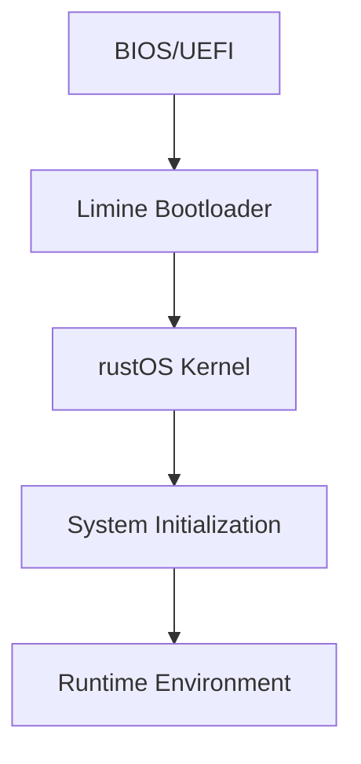

# Bare Metal Implementation with Limine and Rust

## Overview
This document outlines the strategy for the bare metal implementation of rastOS, focusing on the Limine bootloader and Rust bindings for low-level system programming.

## Bootloader: Limine

### Why Limine?
- Modern, 64-bit focused boot protocol
- Support for 5-level paging
- Advanced features (Framebuffer, terminal, etc.)
- Written in C with clean interfaces for Rust

### Implementation Plan

#### 1. Boot Process


#### 2. Memory Management
- Identity map kernel memory
- Set up paging structures
- Initialize memory allocator
- Support for 5-level paging

#### 3. Rust Integration
- `limine-rs` crate for bootloader interface
- Custom build script for kernel linking
- No-std environment setup
- Panic and allocation handlers

## Rust Bindings and FFI

### Core Crates
```toml
[dependencies]
limine = { git = "https://github.com/limine-bootloader/limine-rs" }
x86_64 = "0.14"
bitflags = "2.0"
spin = "0.9"
```

### Memory Safety
- Safe abstractions over unsafe code
- Zero-cost abstractions for hardware access
- Type-safe interrupt handling
- Memory protection mechanisms

## Development Workflow

### Building
```bash
# Build the kernel
cargo build --target x86_64-unknown-none

# Create bootable ISO
./scripts/make-iso.sh

# Run in QEMU
./scripts/run-qemu.sh
```

### Debugging
- GDB with QEMU integration
- Serial port output
- Panic handler with backtrace
- Hardware breakpoints

## Hardware Support

### Initial Targets
- x86_64 (primary)
- AArch64 (future)
- RISC-V (future)

### Device Drivers
- PS/2 Keyboard
- VGA Text Mode
- ACPI
- AHCI (SATA)
- USB (future)

## Security Considerations
- Kernel address space isolation
- SMAP/SMEP protection
- KASLR (Kernel Address Space Layout Randomization)
- Stack canaries

## Performance Optimization
- Optimized memory layout
- Lazy initialization
- Efficient context switching
- Interrupt coalescing

## Testing Strategy
- Unit tests with custom test framework
- Integration tests in QEMU
- Fuzz testing for critical components
- Continuous integration pipeline

## Future Extensions
- SMP support
- Power management
- Virtualization support
- Live kernel patching

## References
- [Limine Boot Protocol](https://github.com/limine-bootloader/limine)
- [rust-osdev](https://github.com/rust-osdev)
- [The Embedded Rust Book](https://docs.rust-embedded.org/book/)
- [Writing an OS in Rust](https://os.phil-opp.com/)
